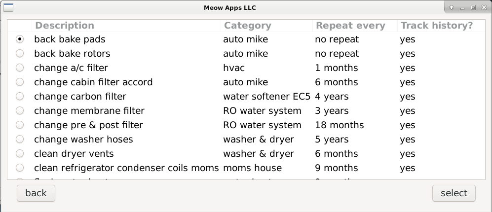

## Overview
Performing routine maintenance on appliances and automotives can greatly prolong
their lifespan. This program is designed to keep track of and schedule
maintenance for any task that satisifes the following conditions:
1. The interval of maintenance is constant
2. Beyond the initial due date the next due date for the item depends only on the last completion date and the interval. 

The program has the additional constraint of requiring the interval to be an
integral quantity of days, weeks, months, or years. (There is also an option for
no repeat.)

The program also allows users to arbitrarily re-assign due dates.

The requirement that the interval be constant can be lessened to an adjustable
rate where the user then has to edit the rate at a time of their choosing. 
Be aware that changing the interval does not automatically update the next due date.

## Use
The main window of the program displays tasks that are currently due. 


We can add items by clicking the button that says add.


This takes us to a window where we can enter fields such as:
- Description: describes the task to be completed.
- Intially Due: sets the intial due date.
- Frequency: sets the interval of completion.
- Category: assign a category to the task for organization, ie automotive.
- Track History?: determines if the completion history should be recorded. 

No duplicate descriptions are allowed. 

The description and category fields will show previous entries as the user types
to help put things in the right category and to avoid duplicate entries. 

Once an item is added, we can edit the item attributes and see the item 
completion history. To do this we click on edit / search in the main window
then select the item.




We can mark items as completed from the main view, simply click the checkbox 
next to the item, and click "mark complete". 
To change the due date ("snooze") the item, click the checkbox, enter the new 
due date in the column titled "Completed on / Push back to" and click "snooze". 

Multiple items can be completed or snoozed at the same time.

If we want to take a look at upcoming tasks, or, if we want to see tasks that 
were completed, we can use "look ahead/back". This takes us to a window where
we can make a quick query such as "ahead 3 months", "back 2 days", or, make a 
specific date range query "From 1/1/2023 to "2/2/2023 inclusive".


Once the date range is slected we will be able to see both upcoming items and
items that were completed in the range selected from the same view. We can 
mark items as complete, snooze them, remove and or edit the completion of tasks
from this view. 


## Quick setup for demo
These instructions have been tested on Debian and might work on other Linux 
distros. They will likely not work on Mac or Windows.

Requirements (that have been tested):
-Debian 10
-sqlite3 v3.27.2
-gtk v3.0

0. Clone the repository
1. Make the database generation code with ```make create```
2. Make the database with ```./create```
3. Make the application with ```make```
4. Run the application with ```./routine```

## Configure the application
There are two provided language header files:
- text\_en.txt for english and 
- es\_text.h for spanish. 
Language selection is set in setup.h by inclusion of the appropriate header. 

Additionally the user may configure how date strings are displayed and handled
by the program by editing the langugae header file.

In particular DATE\_FRMT\_STR selects the date format string (ie %d/%d/%d) and
defining MDY in the language header will cause the format to be m/d/y.

NOTE: It is important that only one permutation of the letter M,D,Y be defined
      for correct program behavior.

## Quirks / Issues
- If an item is snoozed or marked completed in the main view it will disappear
from the list, even if the item is technically still due. This allows the user
to merely click the checkbox and click snooze to snooze an item without having
to change the due date. (The item will of course show up again when re-entering
the main view.) 

- If an item has a historical completion entry removed or edited, the program 
will not (at this point) automatically update the due date. 

- The columns in main view and elsewhere are sortable, however dates are sorted
lexicographically, so unless the user uses a format where lexicographical sorting is
the same as chronological sorting, for example 2023-05-30 type formatting, the
results will be contrary to intuition.  

- The ahead / back view and selected view both suffer from historical completion
showing up a bit too small. The UI needs to be changed to make these view more
elegant. 

## Actually installing the application
There is no installation script at the moment. These instructions are based off
of the instructions available from GTK and have been tested on Debian 10. 

0. Choose the location you want to store the program db in, place the db there and set the macro DATABASE to the correct path in sql\_db.c 
1. (Re-)compile the program to follow the correct path to the database.
2. Place the executable (routine) in /usr/bin
3. Choose an icon, or use the drawing of a fish provided in the repo.
4. Place the icon in the appropriate folder. For me this is in /usr/share/icons/hicolor/48x48/apps/
5. Make a desktop entry called routine.desktop in /usr/share/applications. Mine looks like this: 
```
[Desktop Entry]
Name=Routine
Comment=
Exec=routine
Type=Application
Categories=Office
GenericName=
Keywords=
Icon=/usr/share/icons/hicolor/48x48/apps/fish.png
```

Note: This will install so that any user on the same computer is able to use
the application <em>with the same database</em>. Therefore the appropriate 
permissions may need to be granted to the database. (An install like this makes 
sense, given that it would be great to have all (presumably family members) 
participate in the upkeep of the house.)

To install locally the desktop file should be located in ~./local/share.

Note: One does NOT have to install this to the category of Office, that is 
simply where I have mine stored right now.
